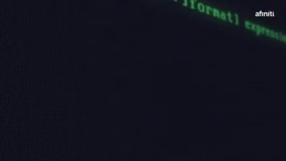

## Hi there! 👋

I'm Abdellah, a passionate developer with a knack for building innovative solutions. I'm always eager to learn and explore new technologies while enhancing my skills.

## About Me

A passionate web development student in my first year at YouCode, I am committed to crafting innovative and efficient digital solutions. My technical expertise spans a diverse range of technologies:

- Front-End: Proficient in HTML,Javascript, CSS, with specialized skills in Tailwind and React

- Back-End: Developing robust applications using PHP and Laravel framework

- Database Management: Experienced in SQL and PostgreSQL

- Design & Prototyping: Skilled in Figma for UI/UX design

- API Development & Testing: Proficient with Postman

- System Design: Experienced in UML conception

- Version Control: Expertise in Git and GitHub workflows

- DevOps: Leveraging Docker for containerization

Driven by an insatiable curiosity and a commitment to continuous learning, I am eager to apply my skills to dynamic, forward-thinking projects where technological innovation meets creative problem-solving.

## Skills & Technologies

  
  
  
  
  
  
  
  
  
  
  
  
  
  
   
  
  

## GitHub Stats

🔹 **Public Repositories**: 24  
🔹 **Followers**: 12  
🔹 **Following**: 11  

## Connect with Me

[LinkedIn](https://www.linkedin.com/in/abdellah-el-malky-3515761b5/)
